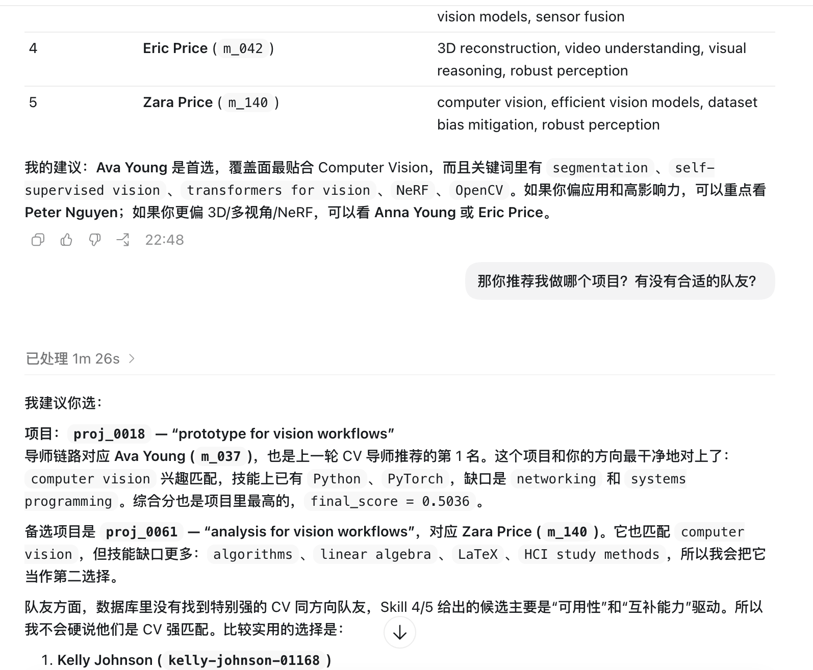

# ProgRec Agent + Skills & Web Backend

ProgRec 是一个面向本科生科研推荐场景的仓库，组织为 `1 个 Agent + 5 个 Skill`。它既可以被现在常见的 AI agent 直接调用，也可以通过我们做的网页 demo 体验完整流程。

- AI agent 直接体验：如下图，我们的agent和skills的逻辑可以被codex等AI agent直接参考使用
- 网页 demo：<https://demo.wenxiangtao.com/progrec>
- 说明：网页端是我们尝试做的展示层，尚有很多不完善之处，望谅解0.0

## 我们的 Agent 在做什么

`ProgRec Agent` 的目标，是把学生一句自然语言需求变成一条可执行、可解释的科研推荐链路。它不会只给一个“导师名字”，而是会先理解学生画像，再串起多步 skill，最终输出：

- 适合优先联系的导师
- 可以切入的项目方向
- 可以补足技能缺口的潜在队友
- 每一步推荐背后的理由与中间证据

## 五个 Skill 分别做什么

| Skill | 稳定标识 | 作用 |
| --- | --- | --- |
| Skill 1 | `/student-profiling` | 把学生的文本描述、简历或背景信息标准化成结构化学生画像，包括 `major`、`skills`、`interests`、`experience_summary`、`availability` 等字段。 |
| Skill 2 | `/academic-graph` | 构建并维护异构学术图谱，把导师、论文、主题、项目、学生这些实体连起来，给后续检索和推理提供统一数据底座。 |
| Skill 3 | `/mentor-discovery` | 基于学生画像和 Skill 2 的资源做导师召回与排序，核心产出是“为什么这些导师值得优先看”的候选列表。 |
| Skill 4 | `/project-teammate-discovery` | 围绕已召回导师，进一步扩展出适合切入的项目和潜在合作队友，让推荐结果从“知道找谁”变成“知道怎么开始做”。 |
| Skill 5 | `/social-ranking` | 把导师、项目、队友三类结果联合重排，输出最终推荐包，兼顾匹配度、可解释性和结果多样性。 |

更完整的 skill 契约、输入输出边界和模式说明见 [AGENTS.md](AGENTS.md)。
