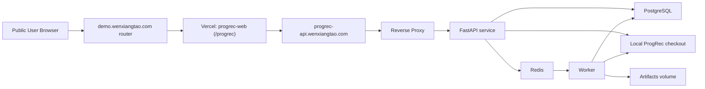

# ProgRec Web Platform Design

Date: 2026-05-13
Status: Proposed
Owner: Codex

## Goal

Design a separate web product, `progrec-web`, that wraps the existing `ProgRec` repository as the backend recommendation engine and exposes two public services:

1. an interactive conversational agent experience
2. a pipeline-style job submission and results experience

The system should be deployable in a production-style architecture using:

- Vercel for the public web frontend
- a dedicated always-on Linux machine for the backend API, worker, database, and local `ProgRec` runtime
- a public frontend route at `https://demo.wenxiangtao.com/progrec`
- a public backend API at `https://progrec-api.wenxiangtao.com`

This design assumes users supply their own model credentials (`API key`, `base URL`, and `model name`) and that the product supports both temporary and optionally persisted runtime configurations.

## Product Scope

The public web product should provide:

- a landing page for the ProgRec experience
- a setup flow for user-provided model credentials
- a chat interface for the agent workflow
- a pipeline submission interface
- job status and result pages
- a history page for prior chat sessions and pipeline jobs

The product is public by default. There is no mandatory login requirement in the first version. Users bring their own model credentials. The system should recommend a preferred model configuration but not require it.

## Repositories and Ownership

### `ProgRec`

The current repository remains the recommendation core and backend runtime source. It continues to own:

- Skills 1-5 assets and logic
- `progrec_agent/`
- batch runner behavior
- graph-mode and demo-mode resources
- recommendation artifacts and output contracts

### `progrec-web`

A new sibling repository should be created at:

- `/Users/mount/Desktop/Programming/progrec-web`

This repository should own:

- public frontend pages
- frontend API/BFF routes
- product UI components
- deployment config for Vercel
- frontend runtime profile UX
- job polling and history views

### `progrec-api`

This is not a separate repository by necessity. It is a deployable backend service layer on the Linux host that reads from the local `ProgRec` checkout and exposes stable HTTP APIs for:

- runtime profile testing and persistence
- conversational agent sessions
- async pipeline job creation and inspection
- artifact lookup

## Architecture Overview

The system is intentionally split into three product layers:

1. public product layer
2. backend service layer
3. recommendation runtime layer



### Design principles

- `progrec-web` should not execute the recommendation engine directly.
- `progrec-api` should expose stable contracts and orchestrate backend behavior.
- `ProgRec` should be read locally on the Linux machine and treated as the recommendation runtime source of truth.
- pipeline-style actions should be asynchronous jobs.
- chat interactions should support synchronous or streamed responses.
- the system should be safe for public access while relying on user-supplied model credentials.

## Domain and Routing Model

### Public frontend route

- `https://demo.wenxiangtao.com/progrec`

This is served by a demo router that forwards requests to Vercel.

### Public backend route

- `https://progrec-api.wenxiangtao.com`

This terminates at the Linux machine reverse proxy and forwards to the FastAPI service.

### Implications

The frontend must be designed for a subpath deployment:

- `basePath = /progrec`
- all page routing must work under `/progrec/*`
- all static assets must resolve correctly with the subpath
- refreshes on nested routes such as `/progrec/jobs/[id]` must not break
- SSE responses must survive the demo router forwarding layer

## Public Product UX

### Core navigation

The product should expose three primary app areas:

- `Chat`
- `Pipeline`
- `History`

Plus a dedicated runtime configuration surface:

- `Runtime Config`

### Pages

#### `/progrec`

Landing page with:

- product overview
- explanation of interactive and pipeline modes
- note that users provide their own model credentials
- recommended model information
- CTA to enter the app

#### `/progrec/setup`

Runtime configuration page with:

- recommended model panel
- fields for `API key`, `base URL`, `model name`
- persistence options:
  - use for this session only
  - remember on this device
  - save securely to server
- test connection action
- continue action after success

#### `/progrec/chat`

Interactive agent page with:

- streaming or synchronous message UI
- clarification cards
- recommendation summary cards
- session summary side panel
- current runtime configuration summary
- clear session action

#### `/progrec/pipeline`

Pipeline submission page with tabs or segmented controls for:

- existing-student pipeline runs
- temporary-profile pipeline runs

#### `/progrec/jobs/[id]`

Async job status and result page with:

- queued/running/succeeded/failed states
- stage progress
- summary metrics
- top entity cards
- artifact links
- retry action

#### `/progrec/history`

History page with:

- recent chat sessions
- recent pipeline jobs
- quick links into details

## Frontend Visual System

The product should use the following UI stack:

- `Next.js`
- `TypeScript`
- `Tailwind CSS`
- `shadcn/ui`
- `lucide-react`
- `motion`

### Visual guidance

The visual direction should feel like an academic AI product, not a generic admin dashboard.

Recommended style:

- warm light background
- restrained deep green or blue-gray accent palette
- subtle editorial texture or structured background
- crisp card hierarchy
- selective motion for:
  - page enter
  - chat reveal
  - result card stagger
  - job state transitions

### UI library usage rule

The libraries are foundational, not the finished aesthetic:

- `shadcn/ui` supplies the reusable primitives
- `lucide-react` supplies the icon system
- `motion` supplies meaningful transitions

The product should avoid default “AI dashboard” styling and should establish a distinct ProgRec look.

## Frontend Tech Stack

Recommended stack for `progrec-web`:

- `Next.js` App Router
- `TypeScript`
- `Tailwind CSS`
- `shadcn/ui`
- `lucide-react`
- `motion`
- `React Hook Form`
- `Zod`
- `TanStack Query`
- `Drizzle ORM`

## Frontend Repository Structure

Recommended structure:

```text
progrec-web/
├── app/
│   ├── (marketing)/
│   ├── (app)/
│   │   ├── chat/
│   │   ├── pipeline/
│   │   ├── jobs/[id]/
│   │   ├── history/
│   │   └── setup/
│   ├── api/
│   ├── globals.css
│   └── layout.tsx
├── components/
│   ├── ui/
│   ├── layout/
│   ├── setup/
│   ├── chat/
│   ├── pipeline/
│   ├── jobs/
│   └── history/
├── lib/
│   ├── api/
│   ├── config/
│   ├── runtime-profile/
│   ├── validators/
│   └── utils/
├── server/
│   ├── actions/
│   ├── repositories/
│   ├── services/
│   └── mappers/
├── drizzle/
├── public/
├── next.config.ts
└── package.json
```

### Frontend state strategy

- local component state for immediate UI interactions
- `TanStack Query` for remote job status, saved profiles, and session metadata
- `sessionStorage` or `localStorage` for browser-kept runtime configuration and current session references
- minimal global context only for shell-level state such as runtime summary and current session identifiers

## Runtime Profile Behavior

Users provide:

- `API key`
- `base URL`
- `model name`

The product should support three storage modes:

1. session-only
2. remembered on the current device
3. securely saved to server

Default should be session-only.

### Recommended model support

The system should surface a recommended configuration via backend-provided metadata, but users remain free to use any OpenAI-compatible endpoint that satisfies the required behavior.

## Backend API Responsibilities

The backend service should be implemented as a FastAPI service on the Linux machine and should expose five families of routes:

1. `system`
2. `runtime-profiles`
3. `agent`
4. `pipeline`
5. `artifacts`

## API Contract

### System routes

- `GET /health`
- `GET /models/recommended`

### Runtime profile routes

- `POST /runtime-profiles/test`
- `POST /runtime-profiles`
- `GET /runtime-profiles/:id`

### Agent routes

- `POST /agent/sessions`
- `POST /agent/sessions/:id/messages`
- `GET /agent/sessions/:id`
- `GET /agent/sessions/:id/messages`

The `messages` endpoint should support synchronous JSON responses and optionally streamed responses via SSE.

### Pipeline routes

- `POST /pipeline/jobs`
- `GET /pipeline/jobs/:id`
- `GET /pipeline/jobs/:id/result`
- `POST /pipeline/jobs/:id/retry`

### Artifact routes

- `GET /artifacts/:job_id/:artifact_name`

## Agent Interaction Model

The conversational layer should use the `ProgRec` V2 agent behavior designed in the prior conversational redesign work:

- stateful clarification
- semantic parsing
- execution planning
- follow-up context handling

The web product should expose that capability as a session-based service.

### Agent behavior requirements

- support clarification-first flows
- support follow-up questions after recommendations
- persist session state
- stream or synchronously return assistant replies
- return structured state summaries when useful for the frontend

## Pipeline Interaction Model

Pipeline runs should be asynchronous jobs.

### Existing-student pipeline runs

Expected inputs:

- runtime profile
- `student_id`
- `mode`
- optional `top_k`

### Temporary-profile pipeline runs

Expected inputs:

- runtime profile
- temporary profile payload
- optional `top_k`

### Job model

The frontend should receive:

- immediate `job_id`
- immediate status such as `queued`

Then poll or subscribe to job status until completion.

## Database Design

PostgreSQL on the Linux host should store metadata, not the full artifact bodies.

### Tables

#### `runtime_profiles`

Suggested fields:

- `id`
- `created_at`
- `updated_at`
- `label`
- `base_url`
- `model_name`
- `api_key_encrypted`
- `api_key_last4`
- `is_saved`
- `is_recommended_model`
- `status`
- `last_tested_at`

#### `agent_sessions`

Suggested fields:

- `id`
- `created_at`
- `updated_at`
- `runtime_profile_id`
- `status`
- `current_task`
- `dialog_state_json`
- `last_result_handle`

#### `agent_messages`

Suggested fields:

- `id`
- `session_id`
- `role`
- `content`
- `message_type`
- `created_at`
- `metadata_json`

#### `pipeline_jobs`

Suggested fields:

- `id`
- `created_at`
- `updated_at`
- `runtime_profile_id`
- `status`
- `job_type`
- `mode`
- `profile_source`
- `student_id`
- `request_payload_json`
- `error_message`
- `started_at`
- `completed_at`

#### `pipeline_job_events`

Suggested fields:

- `id`
- `job_id`
- `created_at`
- `event_type`
- `message`
- `event_payload_json`

#### `pipeline_results`

Suggested fields:

- `id`
- `job_id`
- `summary_json`
- `top_mentor_id`
- `top_project_id`
- `top_teammate_id`
- `skill3_artifact_path`
- `skill4_artifact_path`
- `skill5_artifact_path`
- `created_at`

## Secret Handling

Since the site is public and user credentials are accepted, secret handling must be treated as a first-class product concern.

### Storage modes

#### Browser-only

- session storage for session-only mode
- local storage for “remember on this device”
- no server persistence

#### Server-saved

- only when the user explicitly chooses it
- server encrypts before writing to PostgreSQL
- only metadata and masked key details are ever returned

### Requirements

- never store API keys in plaintext
- never log API keys
- never return stored keys to the browser after save
- never place secrets in artifacts or job events
- decrypt only at the point of outbound model usage

### Encryption

The backend should use an application-level encryption key supplied through environment variables. Database access alone must not reveal stored API keys.

## Artifact Storage

Artifacts should be written to the Linux filesystem, not fully stored in PostgreSQL.

Suggested structure:

- `/opt/progrec/data/artifacts/jobs/<job-id>/skill3.json`
- `/opt/progrec/data/artifacts/jobs/<job-id>/skill4.json`
- `/opt/progrec/data/artifacts/jobs/<job-id>/skill5.json`

The database stores:

- job linkage
- summaries
- top entities
- artifact paths

## Linux Host Deployment

The Linux machine should run the backend stack using Docker Compose.

### Services

- `reverse-proxy`
- `progrec-api`
- `progrec-worker`
- `postgres`
- `redis`

### Service responsibilities

#### `reverse-proxy`

- HTTPS termination
- domain routing
- security headers
- request size limits

#### `progrec-api`

- FastAPI HTTP service
- agent endpoints
- runtime profile management
- pipeline job creation

#### `progrec-worker`

- queue consumer
- pipeline execution
- job state updates
- artifact writing

#### `postgres`

- all application metadata tables

#### `redis`

- queue
- transient coordination

### Linux directory layout

Suggested root:

- `/opt/progrec/`

Recommended structure:

- `/opt/progrec/docker-compose.yml`
- `/opt/progrec/.env`
- `/opt/progrec/Caddyfile`
- `/opt/progrec/services/progrec-service/`
- `/opt/progrec/services/ProgRec/`
- `/opt/progrec/data/postgres/`
- `/opt/progrec/data/redis/`
- `/opt/progrec/data/artifacts/`
- `/opt/progrec/logs/`

### Mounting rules

- mount the `ProgRec` code checkout read-only where practical
- mount artifacts and logs read-write
- keep PostgreSQL and Redis data under dedicated persistent volumes

## Reverse Proxy and Public Exposure

Only the reverse proxy should be directly exposed publicly on the Linux host.

Publicly exposed hostnames:

- `progrec-api.wenxiangtao.com`

Internals that must not be directly exposed:

- PostgreSQL
- Redis
- worker ports
- internal FastAPI container ports

### Reverse proxy recommendation

Prefer `Caddy` for:

- automatic TLS
- simpler configuration
- lower maintenance burden

`Nginx` is acceptable if operational preference already exists.

## Vercel Deployment

`progrec-web` should be deployed to Vercel with support for `/progrec` as the application base path.

### Required frontend environment variables

- `NEXT_PUBLIC_APP_BASE_PATH=/progrec`
- `NEXT_PUBLIC_APP_URL=https://demo.wenxiangtao.com/progrec`
- `PROGREC_API_BASE_URL=https://progrec-api.wenxiangtao.com`

Additional environment variables may be added for analytics or future auth, but these are the minimum product-critical values.

### Router assumption

The demo router already supports:

- page traffic forwarding
- static asset forwarding
- SSE forwarding

This allows the chat experience to use true streaming.

## Deployment Phasing

Recommended rollout order:

1. Linux host infrastructure
   - PostgreSQL
   - Redis
   - reverse proxy
   - health endpoint
2. runtime profile API
3. conversational agent API
4. pipeline job and worker system
5. Vercel frontend shell and setup page
6. chat UI with streaming
7. pipeline UI, jobs page, history page
8. final end-to-end domain routing and observability

## Build Order

Recommended implementation order:

1. define backend API contracts
2. implement backend runtime profile and secret handling
3. implement chat session APIs
4. implement async pipeline jobs
5. scaffold `progrec-web`
6. build setup and chat UI
7. build pipeline and jobs UI
8. wire deployment and domains
9. add production hardening

## Production Hardening Requirements

Before calling the system production-ready, add:

- structured error handling
- request size limits
- CORS restrictions
- log redaction
- queue worker restart policy
- DB backup strategy
- health monitoring
- rate limiting or abuse controls as needed for a public app

## Non-Goals

This design does not attempt to:

- replace the core recommendation logic in `ProgRec`
- make the product a general-purpose chatbot
- introduce mandatory user auth in version one
- move the Python runtime to Vercel

## Success Criteria

The platform is successful when:

1. a public user can open `https://demo.wenxiangtao.com/progrec`
2. the user can configure their own model credentials safely
3. the user can use a clarification-first chat assistant backed by `ProgRec`
4. the user can submit async pipeline jobs and inspect their results
5. the system stores metadata safely and artifacts separately
6. the Linux host runs the backend stack reliably through Docker Compose
7. the frontend and backend boundaries remain clear enough for future product evolution

