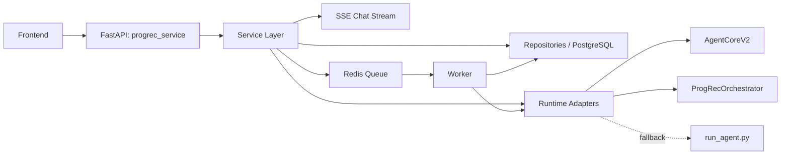

# ProgRec Backend Finalization Design

Date: 2026-05-14
Status: Approved in chat, pending written-spec review
Owner: Codex

## Goal

Finalize the `progrec_service` backend so the current deployable skeleton becomes a working product backend for:

1. streaming chat backed by the existing ProgRec V2 agent flow
2. asynchronous pipeline jobs backed by the existing ProgRec recommendation runtime

This design is intentionally scoped to the five known backend gaps called out in the deployment runbook:

1. real message delivery to ProgRec V2
2. `GET /pipeline/jobs/{id}` and result retrieval
3. worker queue consumption
4. persistent storage for sessions, messages, jobs, and results
5. real pipeline execution

Out of scope for this design:

- authentication and user accounts
- multi-tenant authorization
- rate limiting
- full monitoring platform rollout
- unrelated backend refactors

## Current State

The repository already contains a deployable backend foundation:

- `FastAPI` app wiring in `progrec_service/app.py`
- system routes and a runtime profile test placeholder
- skeleton routes for agent session creation and pipeline job creation
- Redis/PostgreSQL deployment scaffolding in `deployment/`
- a placeholder worker process

The repository also already contains usable runtime internals:

- `progrec_agent/agent_core_v2.py` for conversational recommendation turns
- `progrec_agent/orchestrator.py` for recommendation pipeline execution
- `progrec_agent/run_agent.py` for CLI-based pipeline execution

The missing work is not a new recommendation engine. The missing work is the service-layer integration that turns these internals into a stable backend API with persistence, queue execution, and recovery behavior.

## Selected Approach

Use a service-layer completion approach rather than a minimal patch or a backend rewrite.

### Rejected alternatives

#### Minimal gap patching

This would fill the missing endpoints in place with the smallest possible changes.

Why not:

- it would harden the current skeleton structure into technical debt
- streaming chat and worker retry logic would remain difficult to reason about
- persistence concerns would leak into route handlers

#### Fresh backend rewrite

This would create a second, cleaner backend subsystem and migrate to it later.

Why not:

- too much duplication
- delays value
- does not match the current repository trajectory

### Chosen design

Keep `progrec_service` as the HTTP backend entrypoint, but formalize the internals into:

- API routes
- service orchestration
- repository and database access
- runtime adapters for `progrec_agent`
- Redis-backed queue and real worker execution

This approach reuses the existing ProgRec runtime assets while making the backend maintainable enough for the first complete frontend integration.

## Target Architecture

The finalized backend consists of four stable execution paths:

1. runtime profile path
2. chat session path
3. pipeline job path
4. execution adapter path



### Design principles

- API handlers should remain protocol-focused.
- Business orchestration should live in service classes or service modules.
- Database reads for frontend-facing status should come from PostgreSQL, not ad hoc artifact reads.
- Chat should use streaming `SSE` as the first-class response mode.
- Pipeline execution should run asynchronously through Redis and a real worker.
- Runtime execution should prefer in-process calls and use CLI fallback only as a controlled recovery path.

## Functional Scope

### 1. Runtime profile completion

The backend must support:

- `ephemeral` runtime config passed with a request
- persisted runtime profiles saved on explicit user request
- encrypted storage of persisted API keys
- real connectivity testing against OpenAI-compatible endpoints

Default behavior:

- do not persist user credentials unless the user explicitly asks to save them

### 2. Streaming chat completion

The backend must support:

- session creation
- message submission to a real V2 agent flow
- SSE streaming responses
- persisted session and message history
- retrieval of full message history

Chosen response mode:

- streaming `SSE` is the primary and required mode for first release

### 3. Async pipeline completion

The backend must support:

- async job creation
- real queue enqueue and dequeue
- worker execution
- job status reads
- result reads
- retry by creating a replacement job linked with `supersedes_job_id`

### 4. Real pipeline execution

Execution strategy:

- primary path: in-process execution through `ProgRecOrchestrator`
- fallback path: subprocess execution through `python3 progrec_agent/run_agent.py`

The fallback is not a public API behavior. It is an internal worker recovery mechanism.

## Data Model

PostgreSQL should become the system of record for all frontend-visible backend state.

### `runtime_profiles`

Purpose:

- persisted reusable runtime configuration metadata

Suggested fields:

- `id`
- `label`
- `base_url`
- `model`
- `api_key_ciphertext`
- `api_key_last4`
- `created_at`
- `updated_at`

Rules:

- only explicit saved profiles are stored here
- no plaintext API key may be persisted

### `agent_sessions`

Purpose:

- top-level container for a chat session

Suggested fields:

- `id`
- `runtime_profile_id` nullable
- `session_mode`
- `status`
- `last_result_handle`
- `created_at`
- `updated_at`

Status values:

- `active`
- `closed`

### `agent_messages`

Purpose:

- persisted user and assistant turns

Suggested fields:

- `id`
- `session_id`
- `role`
- `content_text`
- `structured_payload`
- `stream_status`
- `created_at`

Rules:

- persist user messages
- persist final assistant responses
- persist structured recommendation summaries
- do not persist token-level SSE fragments as separate rows

Stream status values:

- `received`
- `streaming`
- `completed`
- `failed`

### `pipeline_jobs`

Purpose:

- authoritative async job record

Suggested fields:

- `id`
- `supersedes_job_id` nullable
- `job_type`
- `runtime_profile_id` nullable
- `request_payload`
- `status`
- `progress_stage`
- `progress_message`
- `attempt_count`
- `worker_name`
- `queued_at`
- `started_at`
- `finished_at`
- `error_code`
- `error_message`

Status values:

- `queued`
- `running`
- `succeeded`
- `failed`
- `retryable`

Progress stage values:

- `validating_input`
- `preparing_runtime`
- `running_skill3`
- `running_skill4`
- `running_skill5`
- `writing_artifacts`
- `completed`

Rules:

- `request_payload` stores a snapshot of the original execution request
- frontend job status reads come from this table

### `pipeline_results`

Purpose:

- final structured result for a completed job

Suggested fields:

- `id`
- `job_id`
- `result_payload`
- `summary_payload`
- `artifacts_payload`
- `created_at`

Rules:

- `GET /pipeline/jobs/{id}/result` should read from this record
- do not reconstruct result responses by re-reading artifact files on demand

### `artifacts`

Purpose:

- indexed metadata for result artifacts written to disk

Suggested fields:

- `id`
- `job_id`
- `artifact_type`
- `relative_path`
- `media_type`
- `size_bytes`
- `checksum`
- `created_at`

Rules:

- artifacts remain file-backed
- frontend-facing metadata is served from PostgreSQL

### `worker_events`

Purpose:

- operational event log for queue and execution behavior

Suggested fields:

- `id`
- `job_id`
- `event_type`
- `payload`
- `created_at`

Example event types:

- `enqueued`
- `started`
- `stage_changed`
- `fallback_to_cli`
- `succeeded`
- `failed`

## API Contract

### Runtime profile APIs

#### `POST /runtime-profiles/test`

Behavior:

- validates a submitted runtime config by making a real minimal probe request to the configured OpenAI-compatible endpoint

Success example:

```json
{
  "ok": true,
  "provider": "openai-compatible",
  "model": "gpt-4.1-mini",
  "latency_ms": 420
}
```

#### `POST /runtime-profiles`

Behavior:

- creates a persisted runtime profile when the user explicitly asks to save one

Response shape:

- returns a new `profile_id`
- returns only masked credential metadata

#### `GET /runtime-profiles/{id}`

Behavior:

- retrieves a persisted runtime profile without exposing plaintext secrets

### Chat session APIs

#### `POST /agent/sessions`

Behavior:

- creates a new chat session
- accepts either `ephemeral_runtime` or `runtime_profile_id`

Response example:

```json
{
  "session_id": "as_xxx",
  "status": "active"
}
```

#### `POST /agent/sessions/{id}/messages`

Behavior:

- accepts one user message
- invokes the real V2 agent path
- returns an SSE stream

Headers:

- request body: `application/json`
- response: `text/event-stream`

Accepted runtime input:

- request-scoped `ephemeral` runtime
- persisted `runtime_profile_id`

Suggested SSE event types:

- `session.created`
- `message.accepted`
- `agent.stage`
- `agent.delta`
- `agent.result`
- `agent.error`
- `done`

Event semantics:

- `agent.stage`: emits state transitions such as `parsing_intent`, `asking_clarification`, `running_recommendation`
- `agent.delta`: emits streamed assistant text chunks
- `agent.result`: emits the final structured recommendation payload
- `done`: marks successful end-of-stream

#### `GET /agent/sessions/{id}/messages`

Behavior:

- returns full persisted message history for session restoration

Rules:

- no token-level replay
- only full persisted messages and structured payloads

### Pipeline APIs

#### `POST /pipeline/jobs`

Behavior:

- validates request payload
- creates a job row
- enqueues the job into Redis

Accepted runtime input:

- request-scoped `ephemeral` runtime
- persisted `runtime_profile_id`

Supported job types:

- `recommend_existing_student`
- `recommend_temporary_profile`

Response example:

```json
{
  "job_id": "job_xxx",
  "status": "queued"
}
```

#### `GET /pipeline/jobs/{id}`

Behavior:

- returns job status and progress

Response example:

```json
{
  "job_id": "job_xxx",
  "status": "running",
  "progress_stage": "running_skill4",
  "progress_message": "Generating teammate and project recommendations",
  "attempt_count": 1
}
```

#### `GET /pipeline/jobs/{id}/result`

Behavior:

- returns the completed structured result

Rules:

- if the job is not yet complete, return `409`
- do not return an empty success body as a placeholder

#### `POST /pipeline/jobs/{id}/retry`

Behavior:

- creates a replacement job rather than mutating the old job in place

Rules:

- the new job references the old one via `supersedes_job_id`
- the original job remains an immutable historical record

## Execution Flows

### Chat execution flow

1. Client calls `POST /agent/sessions/{id}/messages`
2. API persists the user message
3. Service resolves runtime context
4. Service initializes or loads V2 dialog state
5. SSE sends `message.accepted`
6. Runtime adapter invokes the V2 agent path
7. SSE emits `agent.stage` and `agent.delta` events during processing
8. Service persists the final assistant message and structured result
9. SSE emits `agent.result`
10. SSE emits `done`

Chat consistency rule:

- stream completion and final assistant-message persistence must be treated as one logical success path

### Pipeline execution flow

1. Client calls `POST /pipeline/jobs`
2. API validates request
3. Service persists a `queued` job
4. Service enqueues the job into Redis
5. Worker dequeues job
6. Worker sets job to `running`
7. Worker resolves runtime context
8. Worker executes pipeline through in-process orchestrator
9. If recoverable execution criteria match, worker falls back to CLI execution
10. Worker writes artifact files and metadata
11. Worker persists structured result rows
12. Worker sets job status to `succeeded`, `failed`, or `retryable`

Pipeline consistency rule:

- API reads for status and result must come from PostgreSQL, not from direct filesystem inspection

## Code Organization

Do not replace `progrec_service`. Formalize it.

### `api/routes`

Responsibility:

- HTTP request validation
- SSE response creation
- response code mapping
- error formatting

Planned files:

- `progrec_service/api/routes/system.py`
- `progrec_service/api/routes/runtime_profiles.py`
- `progrec_service/api/routes/agent.py`
- `progrec_service/api/routes/pipeline.py`

### `services`

Responsibility:

- chat session orchestration
- runtime profile lifecycle
- job creation and retry logic
- SSE event generation
- runtime context resolution

Planned files:

- `progrec_service/services/runtime_profiles.py`
- `progrec_service/services/agent_sessions.py`
- `progrec_service/services/pipeline_jobs.py`
- `progrec_service/services/sse.py`
- `progrec_service/services/runtime_context.py`

### `db`

Responsibility:

- ORM models
- database sessions
- repository modules
- migrations integration

Planned files:

- `progrec_service/db/models.py`
- `progrec_service/db/session.py`
- `progrec_service/db/repositories/runtime_profiles.py`
- `progrec_service/db/repositories/agent_sessions.py`
- `progrec_service/db/repositories/pipeline_jobs.py`
- `progrec_service/db/repositories/artifacts.py`

### `runtime`

Responsibility:

- isolate backend-facing execution from `progrec_agent` internals
- keep route and service layers decoupled from runtime details

Planned files:

- `progrec_service/runtime/agent_v2_runner.py`
- `progrec_service/runtime/pipeline_runner.py`
- `progrec_service/runtime/cli_fallback.py`
- `progrec_service/runtime/result_mapper.py`

### `worker`

Responsibility:

- queue protocol
- worker loop
- state transitions
- fallback decisions

Planned files:

- `progrec_service/queue.py`
- `progrec_service/worker.py`
- `progrec_service/worker_loop.py`

## Implementation Milestones

This work should be implemented in five milestones.

### Milestone 1: Persistence foundation

Deliverables:

- PostgreSQL schema for runtime profiles, sessions, messages, jobs, results, artifacts, and worker events
- real DB session management
- migrations setup
- repository layer

Why first:

- every other feature depends on stable persistent records

### Milestone 2: Runtime profile completion

Deliverables:

- real connectivity probe
- persisted runtime profile support
- unified ephemeral and persisted runtime resolution

Why second:

- chat and pipeline should not each invent their own runtime handling path

### Milestone 3: Chat finalization

Deliverables:

- session creation
- message SSE endpoint
- history retrieval
- V2 agent integration
- session and message persistence

### Milestone 4: Pipeline finalization

Deliverables:

- job creation
- status and result retrieval
- retry replacement jobs via `supersedes_job_id`
- Redis enqueue and dequeue
- worker execution
- in-process orchestrator path
- CLI fallback path

### Milestone 5: Operational hardening

Deliverables:

- artifact indexing
- worker event capture
- unified error codes
- deployment and runbook updates
- final verification checklist

## Testing Strategy

Testing should cover four layers.

### 1. Unit tests

Focus:

- runtime context resolution
- chat and job state transitions
- result mapping
- retry replacement behavior
- CLI fallback eligibility logic

### 2. Repository and database tests

Focus:

- encrypted runtime profile persistence
- session and message relationships
- job, result, artifact, and worker event reads
- migration correctness
- job replacement lineage

### 3. API integration tests

Focus:

- runtime profile test endpoint
- session creation endpoint
- message history endpoint
- pipeline job creation
- pipeline job status
- pipeline result reads
- pipeline retry
- correct `409` behavior for incomplete job results
- stable SSE event ordering

### 4. Execution-path integration tests

Focus:

- V2 chat path end to end
- worker path from enqueue through result persistence
- in-process orchestrator success case
- CLI fallback success case after primary-path failure

## Key Risks

### Risk 1: runtime coupling leak

Problem:

- `progrec_agent` internals are currently oriented around local execution and CLI assumptions

Mitigation:

- isolate all runtime coupling in `progrec_service/runtime/`

### Risk 2: SSE and persistence drift

Problem:

- the client could receive a stream without the final assistant message being stored correctly

Mitigation:

- treat end-of-stream and final assistant message persistence as one coordinated success path

### Risk 3: mixed result sources

Problem:

- status or result APIs become inconsistent if some paths read from DB and others read directly from files

Mitigation:

- use PostgreSQL as the authoritative API read source

### Risk 4: uncontrolled fallback spread

Problem:

- CLI fallback becomes a second execution system if its logic is duplicated in many places

Mitigation:

- centralize fallback logic in one runtime adapter module

### Risk 5: delayed migrations

Problem:

- implementing API flows before stable persistence will force rework

Mitigation:

- start with the persistence foundation milestone

## Definition of Done

The backend should be considered in its intended final scoped state when all of the following are true:

- chat requests are delivered to the real ProgRec V2 path through SSE
- session and message history are persisted and retrievable
- pipeline jobs are created, queued, consumed, and executed by a real worker
- pipeline job status and results are retrievable from stable API endpoints
- runtime profiles support both ephemeral and explicit persisted modes
- in-process pipeline execution works and CLI fallback is available as an internal recovery path
- frontend-facing backend state is stored in PostgreSQL
- the deployment runbook no longer describes the five scoped gaps as missing
